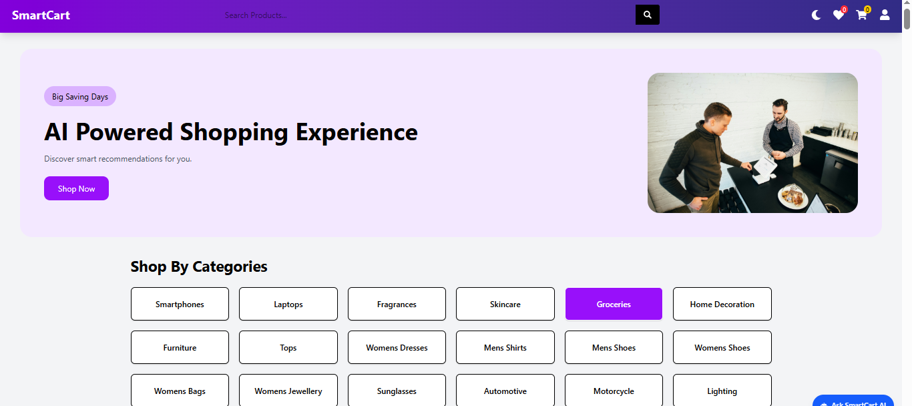
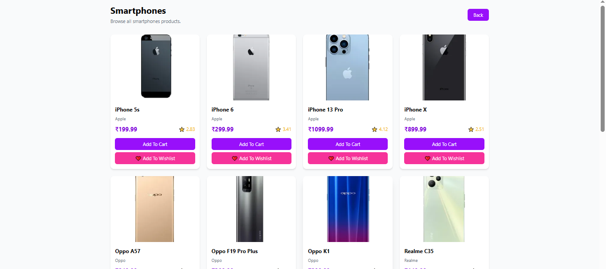
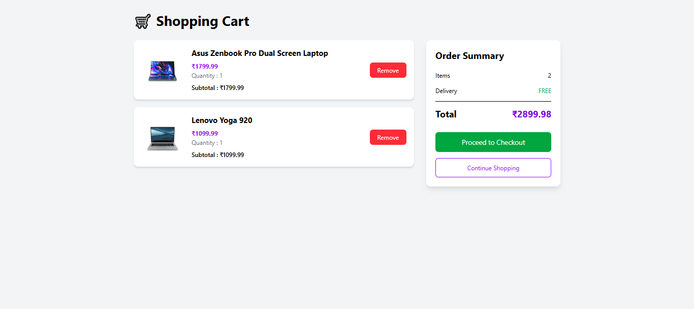
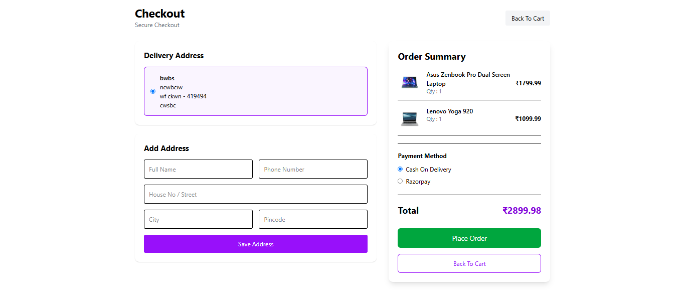
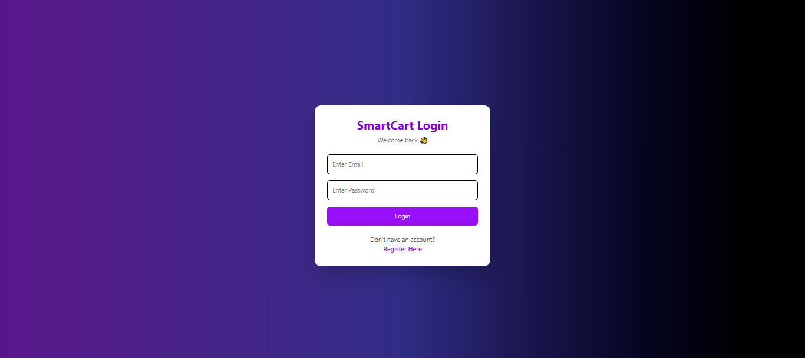

# 🛒 SmartCart AI

<div align="center">

### 🤖 AI Powered Full Stack E-Commerce Website

A modern AI-powered e-commerce web application built using the MERN Stack with Gemini AI integration, shopping cart, wishlist, checkout, and responsive design.

🌐 **Live Demo:** https://smart-cart-ai-sand.vercel.app

💻 **GitHub Repository:** https://github.com/kuchipudivivek84/SmartCart-AI

</div>

---

# 📖 About the Project

SmartCart AI is a modern AI-powered e-commerce platform developed using the MERN Stack. It enables users to browse products, search items, manage a shopping cart and wishlist, complete purchases through a demo Razorpay payment gateway, and interact with an AI chatbot powered by Google Gemini.

The application provides a clean, responsive, and user-friendly shopping experience while showcasing full-stack web development concepts.

---

# ✨ Features

- 🤖 AI Chatbot (Google Gemini)
- 🛍 Product Listing
- 🔍 Product Search
- 📂 Category-wise Products
- 📄 Product Details Page
- 🛒 Shopping Cart
- ❤️ Wishlist
- ➕ Quantity Management
- 💳 Razorpay Demo Payment
- 📦 Order Summary
- 📱 Responsive Design
- 🌙 Dark Mode Support
- ⚡ Fast UI with Vite & React

---

# 🛠 Tech Stack

## Frontend

- React.js
- Vite
- Tailwind CSS
- React Router DOM
- Axios
- React Hot Toast

## Backend

- Node.js
- Express.js
- MongoDB
- Mongoose

## AI Integration

- Google Gemini API

## Payment Gateway

- Razorpay (Demo)

## Deployment

- Vercel

---

# 📸 Project Screenshots

## 🏠 Home Page



---

## 📦 Products Page



---

## 🛒 Shopping Cart



---

## 💳 Checkout Page



---

## 🔐 Login Page



---

# 📁 Project Structure

```text
SmartCart-AI
│
├── public
│
├── src
│   ├── assets
│   ├── components
│   ├── context
│   ├── pages
│   ├── Services
│   ├── utils
│   ├── App.jsx
│   └── main.jsx
│
├── package.json
├── vite.config.js
├── README.md
└── screenshots
```

---

# ⚙️ Installation

## Clone the Repository

```bash
git clone https://github.com/kuchipudivivek84/SmartCart-AI.git
```

## Go to Project Folder

```bash
cd SmartCart-AI
```

## Install Dependencies

```bash
npm install
```

## Run the Project

```bash
npm run dev
```

The application will run at:

```text
http://localhost:5173
```

---

# 💡 Main Functionalities

### 🛍 Product Management

- Browse Products
- Category Filtering
- Product Details

### 🛒 Shopping Cart

- Add Products
- Remove Products
- Increase Quantity
- Decrease Quantity
- Calculate Total

### ❤️ Wishlist

- Add to Wishlist
- Remove from Wishlist

### 💳 Checkout

- Address Management
- Order Summary
- Cash on Delivery
- Razorpay Demo Payment

### 🤖 AI Assistant

- Google Gemini AI Chatbot
- Shopping Assistance
- Product Suggestions

---

# 🚀 Future Enhancements

- User Authentication
- Admin Dashboard
- Product Reviews
- Coupons & Discounts
- Real Payment Verification
- Order Tracking
- Email Notifications
- Inventory Management

---

# 🎯 Learning Outcomes

Through this project I learned:

- React.js Development
- Component-Based Architecture
- Context API State Management
- REST API Integration
- Tailwind CSS
- AI Integration using Gemini
- Payment Gateway Integration
- Responsive UI Design
- Git & GitHub
- Project Deployment using Vercel

---

# 👨‍💻 Developer

**Kuchipudi Vivek**

🎓 B.Tech – Computer Science & Engineering (AI)

🏫 Narayana Engineering College, Nellore

---

## 🌐 Connect with Me

**GitHub**

https://github.com/kuchipudivivek84

**LinkedIn**

https://www.linkedin.com/in/vivek-kuchipudi-7a29a324b

---

# ⭐ Support

If you like this project, please consider giving it a ⭐ on GitHub.

It motivates me to build more useful projects.

---

<div align="center">

## Thank You ❤️

Made with React ⚛️ + Node.js 🚀 + Gemini AI 🤖

</div>
